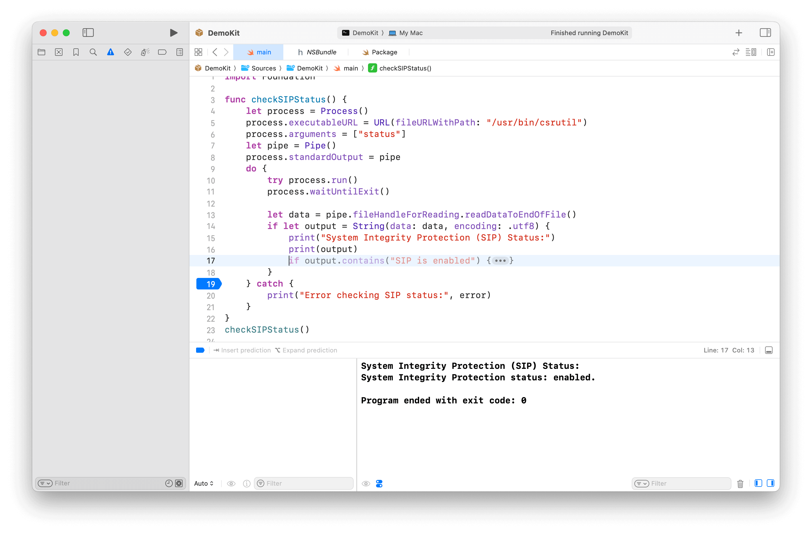
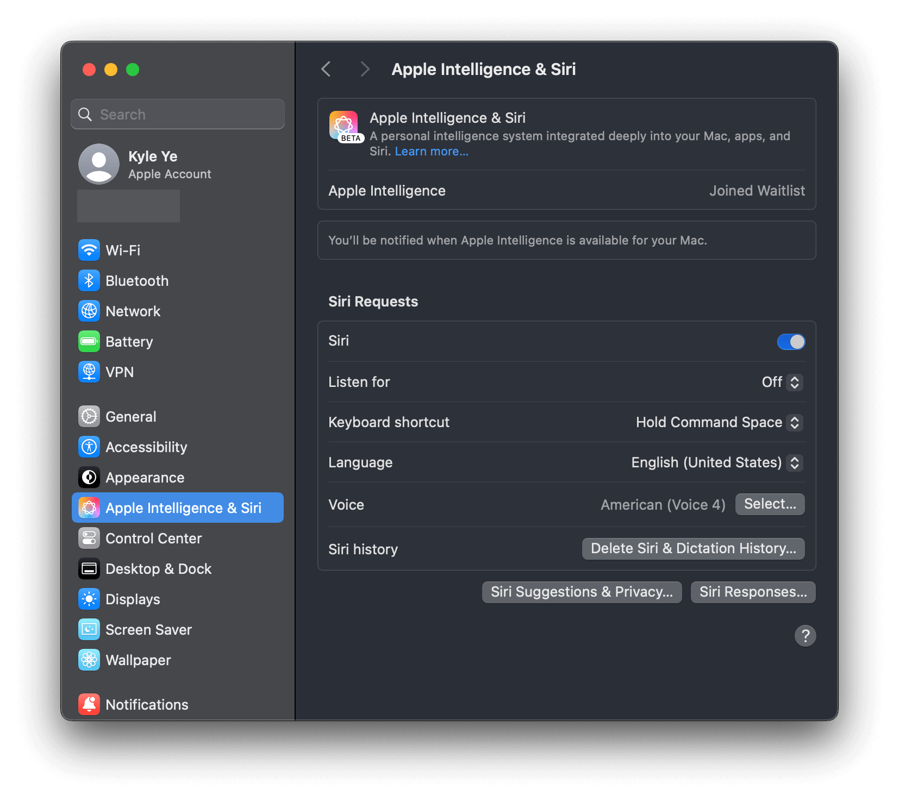
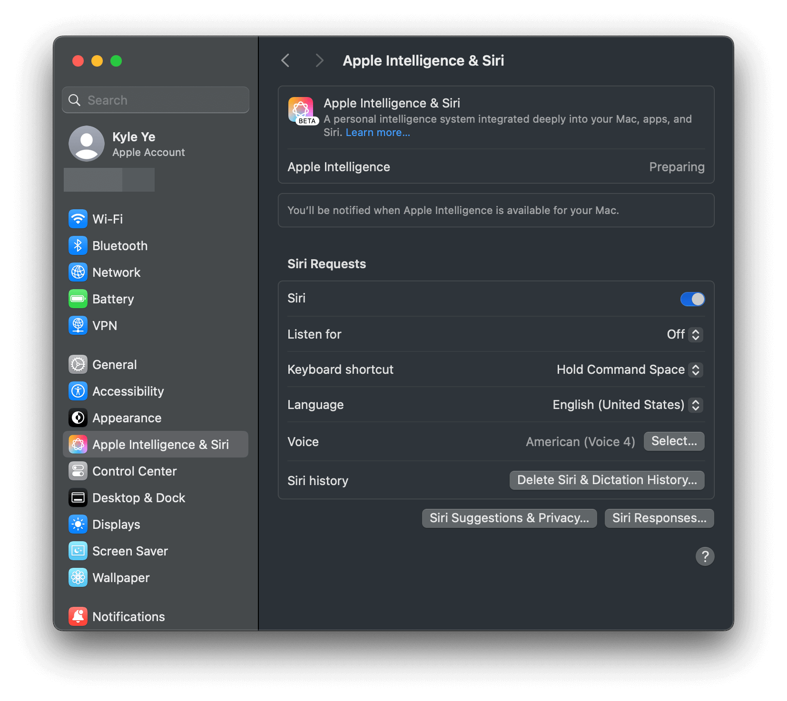

## <div align="center"><b><a href="README.md">English</a> | <a href="README_CN.md">简体中文</a></b></div>

# Darwin Eligibility Override

This project aims to achieve permanent use of Xcode LLM/Apple Intelligence on any Mac
without disabling System Integrity Protection (SIP) or only disabling it once.

> [!NOTE]
> Xcode LLM is only supported on macOS 15.0+
>
> Apple Intelligence is only supported on macOS 15.1+



## Notes

this project is for learning and research purposes only.

If you choose to use this project, you do so at your own risk and are responsible for compliance with any applicable laws.

The author of this project is not responsible for any consequences that may arise from your use of this project.

## Usage

### Method 1: util tool (Recommended)

Need one time SIP disable + "amfi_get_out_of_my_way=1" set boot-args in during the script.

> [!TIP]
> If you have issue on how to disable SIP or set boot-args, see [Manual Execution](#manual-execution) section for more detail.

```shell
# Force XcodeLLM to be eligible
curl -L https://raw.githubusercontent.com/Kyle-Ye/XcodeLLMEligible/release/0.2/scripts/override.sh | bash -s -- install util xcodellm
# Force Apple Intelligence to be eligible
curl -L https://raw.githubusercontent.com/Kyle-Ye/XcodeLLMEligible/release/0.2/scripts/override.sh | bash -s -- install util greymatter
# Force Cleanup to be eligible
curl -L https://raw.githubusercontent.com/Kyle-Ye/XcodeLLMEligible/release/0.2/scripts/override.sh | bash -s -- install util strontium
```

### Method 2: override file

Do not require disable SIP at all.

```shell
# Override XcodeLLM only
curl -L https://raw.githubusercontent.com/Kyle-Ye/XcodeLLMEligible/release/0.2/scripts/override.sh | bash -s -- install override xcodellm
# Override Apple Intelligence only
curl -L https://raw.githubusercontent.com/Kyle-Ye/XcodeLLMEligible/release/0.2/scripts/override.sh | bash -s -- install override greymatter
# For Apple Intelligence + Cleanup
curl -L https://raw.githubusercontent.com/Kyle-Ye/XcodeLLMEligible/release/0.2/scripts/override.sh | bash -s -- install override greymatter+strontium
# For XcodeLLM + Apple Intelligence + Cleanup
curl -L https://raw.githubusercontent.com/Kyle-Ye/XcodeLLMEligible/release/0.2/scripts/override.sh | bash -s -- install override xcodellm+greymatter+strontium
```

> [!NOTE]
> The override file method is mutually exclusive.
>
> This repository only provides separate override files for Xcode LLM and Apple Intelligence.
>
> If you want to override multi key, please use util tool method and export the override file for your future use.

## Uninstall

### Method 1: util tool

```shell
# For XcodeLLM:
curl -L https://raw.githubusercontent.com/Kyle-Ye/XcodeLLMEligible/release/0.2/scripts/override.sh | bash -s -- uninstall util xcodellm
# For Apple Intelligence
curl -L https://raw.githubusercontent.com/Kyle-Ye/XcodeLLMEligible/release/0.2/scripts/override.sh | bash -s -- uninstall util greymatter
# For Clenaup as part of Apple Intelligence feature
curl -L https://raw.githubusercontent.com/Kyle-Ye/XcodeLLMEligible/release/0.2/scripts/override.sh | bash -s -- uninstall util strontium
```

### Method 2: override file

```shell
# For XcodeLLM:
curl -L https://raw.githubusercontent.com/Kyle-Ye/XcodeLLMEligible/release/0.2/scripts/override.sh | bash -s -- uninstall override xcodellm
# For Apple Intelligence
curl -L https://raw.githubusercontent.com/Kyle-Ye/XcodeLLMEligible/release/0.2/scripts/override.sh | bash -s -- uninstall override greymatter
# For Apple Intelligence + Cleanup
curl -L https://raw.githubusercontent.com/Kyle-Ye/XcodeLLMEligible/release/0.2/scripts/override.sh | bash -s -- uninstall override greymatter+strontium
# For XcodeLLM + Apple Intelligence + Cleanup
curl -L https://raw.githubusercontent.com/Kyle-Ye/XcodeLLMEligible/release/0.2/scripts/override.sh | bash -s -- uninstall override xcodellm+greymatter+strontium
```

## Manual Execution

### Method 1: util tool (Recommended)

1. Disable SIP in recovery mode with `csrutil disable`

2. Add boot argument by `sudo nvram boot-args="amfi_get_out_of_my_way=1"` and reboot

3. Download `eligibility_util` from the [release page](https://github.com/Kyle-Ye/XcodeLLMEligible/releases) and add executable permission.

> The following command example assumes the downloaded file is in the `~/Downloads` folder.

```shell
chmod +x ~/Downloads/eligibility_util
```

4. Execute the following command

```shell
cd ~/Downloads
# For XcodeLLM:
./eligibility_util forceDomainAnswer --domain-name OS_ELIGIBILITY_DOMAIN_XCODE_LLM --answer 4
# For Apple Intelligence (macOS 15.1+ required)
./eligibility_util forceDomainAnswer --domain-name OS_ELIGIBILITY_DOMAIN_GREYMATTER --answer 4
# For Cleanup as part of Apple Intelligence feature (macOS 15.1 Beta 3+ required)
./eligibility_util forceDomainAnswer --domain-name OS_ELIGIBILITY_DOMAIN_STRONTIUM --answer 4
```

4. Enable SIP in recovery mode with `csrutil enable` and reboot.

5. Remove boot argument by `sudo nvram -d boot-args`

> Read [Disabling and Enabling System Integrity Protection](https://developer.apple.com/documentation/security/disabling_and_enabling_system_integrity_protection) if you are unfamiliar with SIP operation.
>
> You can only set boot-args in recovery mode or normal mode with SIP disabled.
>
> After setting boot-args, remember to reboot to make the change take effect.

> [!TIP]
>
> For more technical detail, see [Kyle-Ye/eligibility](https://github.com/Kyle-Ye/eligibility)


### Method 2: override file

No SIP disabled needed in total.

1. Download the corresponding `*.eligibility_overrides.data` file from the [release page](https://github.com/Kyle-Ye/XcodeLLMEligible/releases) and rename it to `eligibility_overrides.data`

> For Xcode LLM, download [xcodellm.eligibility_overrides.data](https://github.com/Kyle-Ye/XcodeLLMEligible/releases/latest/download/xcodellm.eligibility_overrides.data)
> 
> For Apple Intelligence, download [greymatter.eligibility_overrides.data](https://github.com/Kyle-Ye/XcodeLLMEligible/releases/latest/download/greymatter.eligibility_overrides.data)

2. Find the correct container uuid for `eligibilityd` under `/private/var/root/Library/Daemon\ Containers`

List all container uuid by the following command:
```shell
sudo ls /private/var/root/Library/Daemon\ Containers
```

3. Move downloaded file in the first step to the `Data/Library/Caches/NeverRestore/` folder of the corresponding Deamon container. If you are not sure which one is the correct container directory for eligibilityd, you can try it one by one or add the downloaded files to all Deamon containers.

```shell
sudo mkdir /private/var/root/Library/Daemon\ Containers/<UUID>/Data/Library/Caches/NeverRestore
sudo cp eligibility_overrides.data /private/var/root/Library/Daemon\ Containers/<UUID>/Data/Library/Caches/NeverRestore/
```

4. Relaunch the `eligibilityd` service

```shell
sudo pkill -9 eligibilityd
sudo launchctl kickstart -k system/com.apple.eligibilityd
```

## Trouble Shooting / FAQ

> [!TIP]
> The difference of eligibility_util and eligibility_util_sip is that the former is for SIP disabled environment and the latter is for SIP enabled environment.

### Issue of Method 1: util tool 

1. If you see the following output

```shell
zsh: no such file or directory: ./eligibility_util
```

Please make sure the current working directory contains the `eligibility_util` file.

2. If you see the following output

```shell
zsh: permission denied: ./eligibility_util
```

Please make sure you have added the executable permission to the `eligibility_util` file via `chmod +x ./eligibility_util`.(Check step 3 in [Manual Execution](#manual-execution))

3. If you see the following output

```shell
>[1]    61672 killed     ./eligibility_util
```

Please make sure you have disabled SIP and set the boot-args correctly. (Check step 1 and 2 in [Manual Execution](#manual-execution))

4. Other issue

```shell
curl -L https://raw.githubusercontent.com/Kyle-Ye/XcodeLLMEligible/release/0.2/scripts/override.sh | bash -s -- doctor
```

### Issue of Method 2: override file

If you are unable to access the Daemon Container related folders, please check if the terminal app you are using has full disk access permission.

Path: Settings.app > Security & Privacy > Full Disk Access -> Add your terminal app to the list and enable it.

### Other Xcode LLM related issue

1. Confirom the override is working and you have the correct answer.

```
./eligibility_util_sip getDomainAnswer --domain-name OS_ELIGIBILITY_DOMAIN_XCODE_LLM
```

2. Reenable SIP and then open Xcode to download Model.

See detail for [#4](https://github.com/Kyle-Ye/XcodeLLMEligible/issues/4)

### Other Apple Intelligence related issue

> [!IMPORTANT]
> Suggestions:
> 1. Log in with a US Apple ID
> 2. Set Region to United States and English as the primary language
> 3. Set English (United States) as your Siri language

1. Confirom the override is working and you have the correct answer.

```
./eligibility_util_sip getDomainAnswer --domain-name OS_ELIGIBILITY_DOMAIN_GREYMATTER
```

2. Go to Setting.app and choose "Apple Intelligence & Siri", click "Join Apple Intelligence Waitlist" button.


3. You'll see "Joined Waitlist" label and wait for a while.



4. You'll see "Preparing" label and wait for a while.



5. You'll receive "Apple Intelligence is Here" notification.


6. You can now turn on Apple Intelligence to use it.


### Other FAQ

1. Will "Eligibility Overrid" still work after an OS update?

Probably yes. Eligibility Override does not require you to execute the steps again after an OS update.

But Apple may change the Eligibility mechanism in the future, so it is not guaranteed to work after an OS update. 

## Related links

- https://github.com/Kyle-Ye/eligibility/

- https://gist.github.com/Kyle-Ye/4ad1aa92df3a31bd812487af65e16947
- https://gist.github.com/unixzii/6f25be1842399022e16ad6477a304286

## Star History

[](https://star-history.com/#Kyle-Ye/XcodeLLMEligible&Date)

## License

MIT. See LICENSE file.